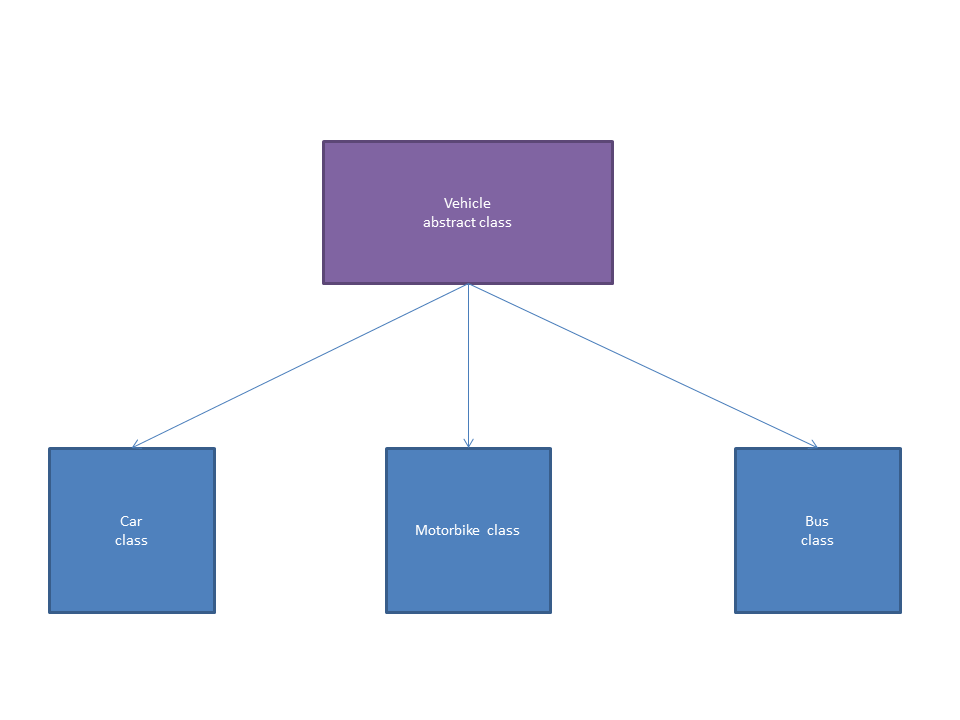

# Garage Challenge

## Tasks

1. Using Vehicle as a base class, create three derived classes (Car, Motorbike, etc.). Each derived class should have its own attributes in addition to the normal Vehicle attributes.

2. Using a List<> implementation, store all your Vehicles in a Garage class.

3. Create a method in Garage that iterates through each Vehicle, calculating a bill for each type of Vehicle in a different way, depending on the type of Vehicle it is (this does not need to be complex).

4. Garage should have methods that add a Vehicle, remove a Vehicle by its ID or its type, fix a Vehicle (which calculates the bill) and to empty the Garage.

5. Garage should have a method to remove multiple Vehicles by their type.

## Extended

* we can check the Type of an object using typeOf() - have a look into this method and implement it instead of switch/case statements

```java
if ( i.getClass().getSimpleName().equals("Car") ) {
	bill = 1 * i.seats() * i.wheels();
} else if ( i.getClass().getSimpleName().equals("Motorbike") ) {
	bill = 2 * i.seats() * i.wheels();
} else if ( i.getClass().getSimpleName().equals("Bus") ) {
	bill = 3 * i.seats() * i.wheels();
} 
```

* maybe it's worth making a diagram for this, too!

